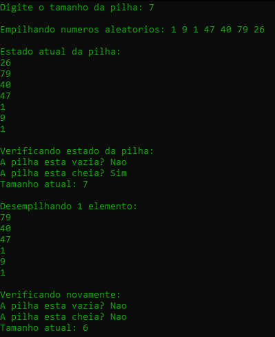

<h1>Pilha Estática</h1>

## Tópicos

- [Sobre o Projeto](#sobre-o-projeto) 
- [Conceito LIFO](#conceito-lifo) 
- [Estrutura do Projeto](#estrutura-do-projeto)  
- [Funcionalidades](#funcionalidades)  
- [Tecnologias](#tecnologias)  
- [Como executar o projeto](#como-executar-o-projeto)

# Sobre o Projeto
Este projeto implementa uma Pilha Estática em linguagem C, com o objetivo de demonstrar os conceitos básicos de estrutura de dados e de pilha. O código está organizado com separação entre arquivos de cabeçalho (`.h`) e implementação (`.c`). 

# Conceito LIFO

A pilha é uma estrutura do tipo LIFO (Last In, First Out) — "Último a entrar, primeiro a sair". Isso significa que o último elemento que foi colocado na pilha será o primeiro a ser removido. Imagine uma pilha de pratos: você coloca pratos um sobre o outro e só pode pegar o prato que está no topo.


# Estrutura do Projeto
## `include/`

### `pilha.h`
- Define a estrutura da pilha estática (t_pilha)

- Protótipos das funções para manipulação da pilha (criar, empilha, desempilha, tamanho, verificar se vazia/cheia).

## `src/`

### main.c              
- Programa principal que demonstra o uso da pilha estática
  
### pilha_vetor.c       
- Implementação das funções para manipulação da pilha estática


# Funcionalidades
- Inicialização da pilha estática com capacidade definida pelo usuário.

- Inserção (empilhar) de elementos na pilha, respeitando o limite de capacidade.

- Remoção (desempilhar) de elementos da pilha.

- Verificação se a pilha está vazia ou cheia.

- Consulta do tamanho atual da pilha.

- Impressão visual do conteúdo atual da pilha.

- Uso de números aleatórios para popular a pilha na demonstração.


# Tecnologias
<table align="center">
    <tr>
        <th>
            Linguagem
        </th>
        <td>
            
        </td>
    </tr>
    <tr>
        <th>
            Editor
        </th>
        <td>
            
        </td>
    </tr>
</table>

# Como executar o projeto

1. Clone este repositório:
```bash
git clone https://github.com/pedro-Trovo/pilha-estatica
```
2. Acesse a pasta do projeto:
```bash
cd pilha-estatica
```
3. Compile o projeto com gcc:
```bash
gcc gcc src/main.c src/pilha_vetor.c -Iinclude -o pilha
```
4. Execute o programa :
```bash
pilha.exe
```
<br><br>

# Imagens do Projeto
<div align="center">
  
</div>
